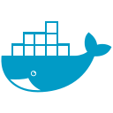

# Axel Fecha

**Software Developer · Backend Java / Kotlin · Frontend Angular**  
Buenos Aires, Argentina

Desarrollo aplicaciones con Java, Kotlin y TypeScript. Mi stack principal incluye Spring Boot, Quarkus y Angular; también trabajo con React. En mis proyectos aplico modelado de dominio, arquitectura hexagonal y por capas, APIs e integración mediante eventos.

[LinkedIn](https://www.linkedin.com/in/axel-fecha-225837274/) · [Email](mailto:axel.fecha.cit@gmail.com)

---

## Proyectos

### [Fixy](https://github.com/youngnicoJava/fixy-readme)

Plataforma de servicios para conectar personas con profesionales, gestionar solicitudes y seguir su progreso.

### [Loan Origination Platform](https://github.com/youngnicoJava/loan-approval-engine)

Aplicación de demostración del proceso de préstamos: solicitudes, evaluación, ofertas, desembolsos y cuotas. Arquitectura hexagonal, acceso por roles, auditoría e idempotencia.

**Java · Quarkus · PostgreSQL · Kafka · React · TypeScript**

### [Credit Risk Engine](https://github.com/youngnicoJava/credit-risk-engine)

Servicio de evaluación crediticia con políticas versionadas. Analiza elegibilidad y capacidad de pago, y conserva los motivos de cada decisión. Incluye una consola para consultar evaluaciones y sus factores de scoring.

**Java · Quarkus · PostgreSQL · Kafka · React · TypeScript**

### [Fraud Detection Engine](https://github.com/youngnicoJava/fraud-detection-engine)

Servicio que evalúa señales de comportamiento sospechoso mediante reglas deterministas. Incluye investigación manual, resolución de casos e historial auditable, con arquitectura modular por capas.

**Java · Quarkus · PostgreSQL · Kafka · React · TypeScript**

Los tres proyectos financieros forman un ecosistema de demostración: Loan Origination gestiona el préstamo, Credit Risk evalúa el perfil financiero y Fraud Detection analiza señales e investigación. Se integran por Kafka y mantienen bases de datos independientes.

## Tecnologías

  &nbsp;&nbsp;
  &nbsp;&nbsp;
  &nbsp;&nbsp;
  &nbsp;&nbsp;
  &nbsp;&nbsp;
  &nbsp;&nbsp;
  &nbsp;&nbsp;
  

| Área | Herramientas y conceptos |
| :--- | :--- |
| Backend | Java, Kotlin, Spring Boot, Quarkus |
| Frontend | Angular, TypeScript |
| Datos y mensajería | PostgreSQL, Oracle, SQL, Flyway, Kafka |
| Arquitectura | Hexagonal, por capas, microservicios, modelado de dominio |
| Infraestructura | Docker, Linux, CI/CD, GitLab |

**También trabajo con:** React, AWS, Go, Python, Excel y Power BI.

English overview

### About me

I'm Axel Fecha, a software developer based in Buenos Aires, Argentina. I work with Java, Kotlin and TypeScript, primarily using Spring Boot, Quarkus and Angular, alongside React.

My projects explore domain modeling, hexagonal and layered architecture, APIs and event-driven integration. The financial portfolio covers loan origination, explainable credit risk assessments and rule-based fraud detection with manual investigation. Each application owns its domain and database, with Kafka connecting the workflows.

You can find project documentation in the repositories above, or reach me through [LinkedIn](https://www.linkedin.com/in/axel-fecha-225837274/) and [email](mailto:axel.fecha.cit@gmail.com).

